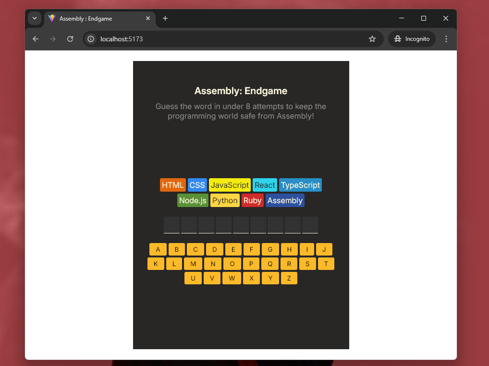
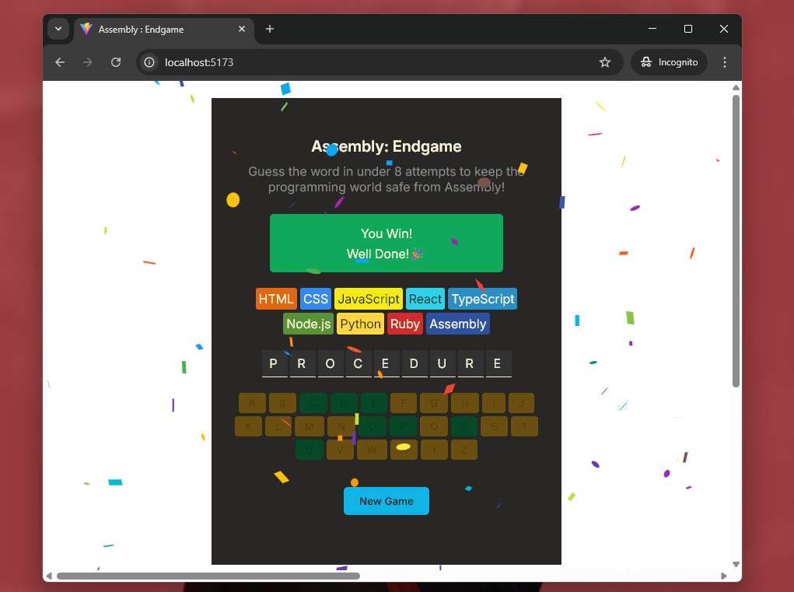
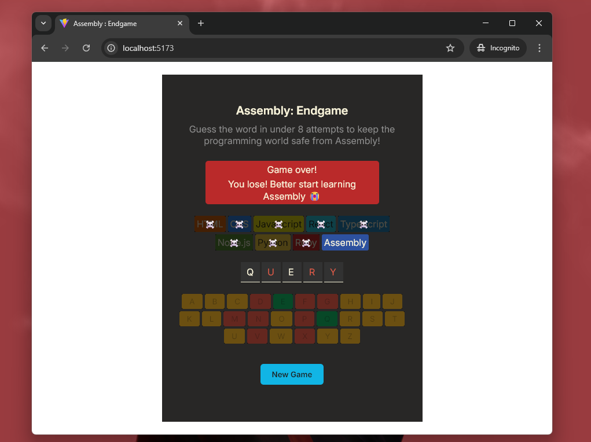

# Assembly: Endgame

Assembly: Endgame is a twist on Hangman where each wrong guess kills off a beloved programming language eight flops and Assembly is the last one standing!

# Screensots

### 1. Initial State

    

### 2. Winning State

    

### 3. Lose And Assembly Takes Over😈

    

