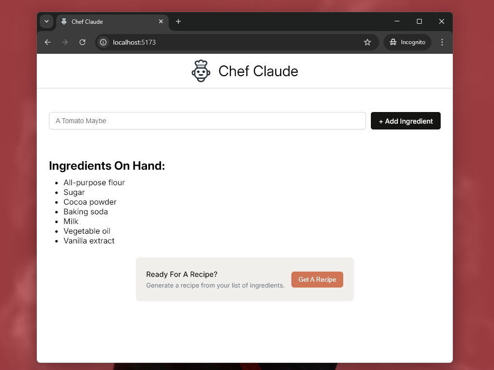
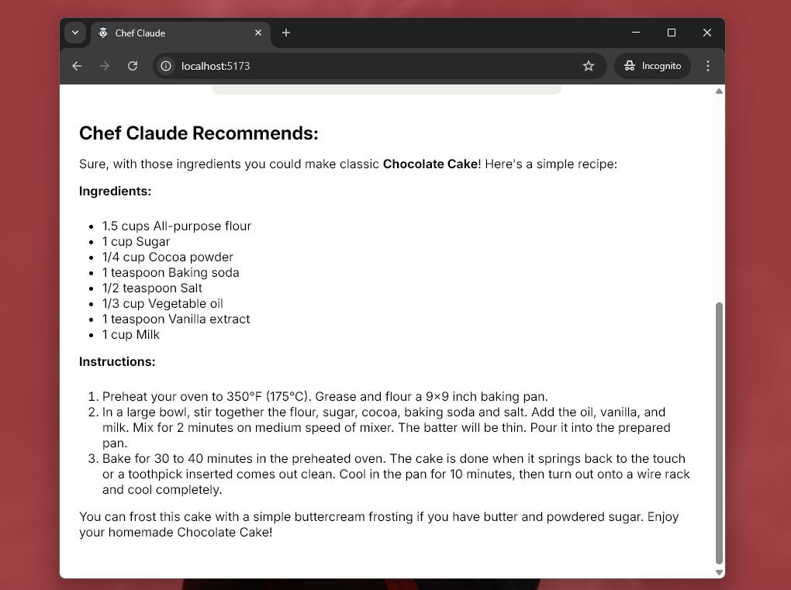

# Chef Claude

AI Chef – A react application that allows users to input a list of ingredients, which is then sent as an API request to an AI model (Mistralai From Hugging Face here) to generate a simple recipe based on the provided ingredients.

# Screensots

### 1. Initial State With Ingredients Added

    

### 2. Final State With Recipe From AI

    

---

> [!NOTE]
> Create a **.env** file in the root directory of the project and define your Hugging Face access token using the key **VITE_HF_ACCESS_TOKEN** (applicable for projects using Vite).