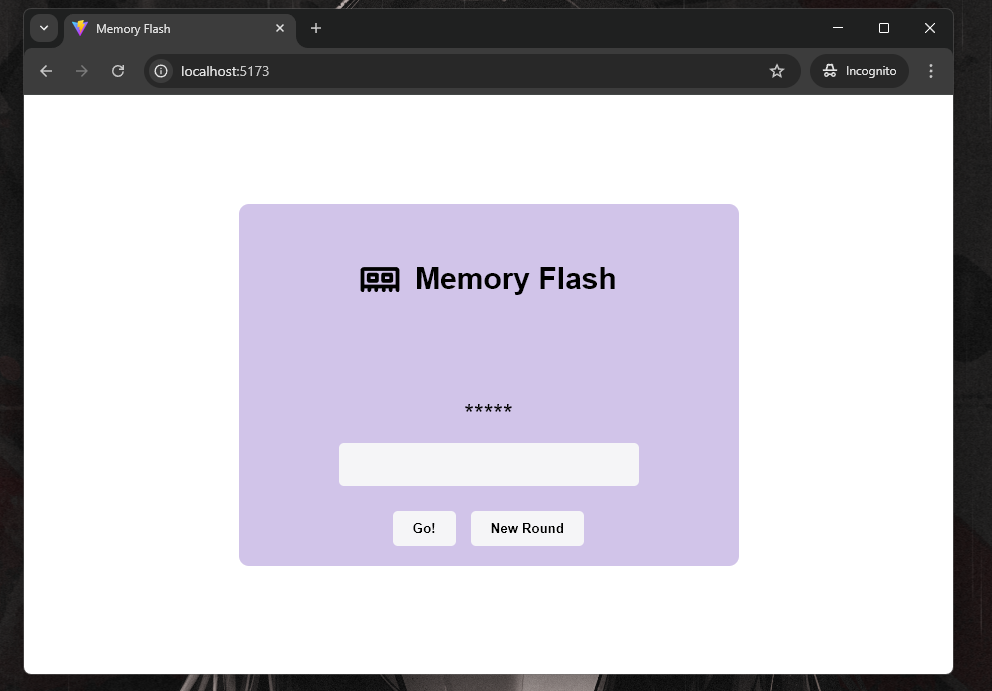
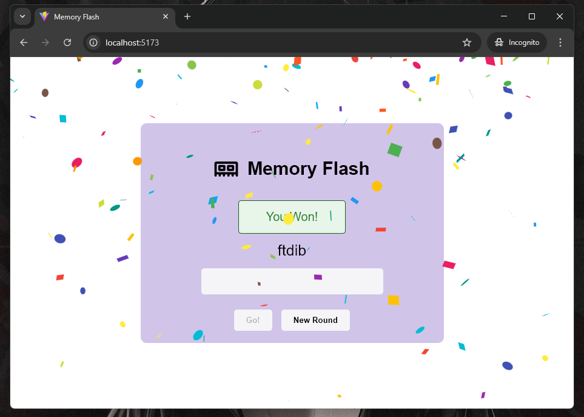
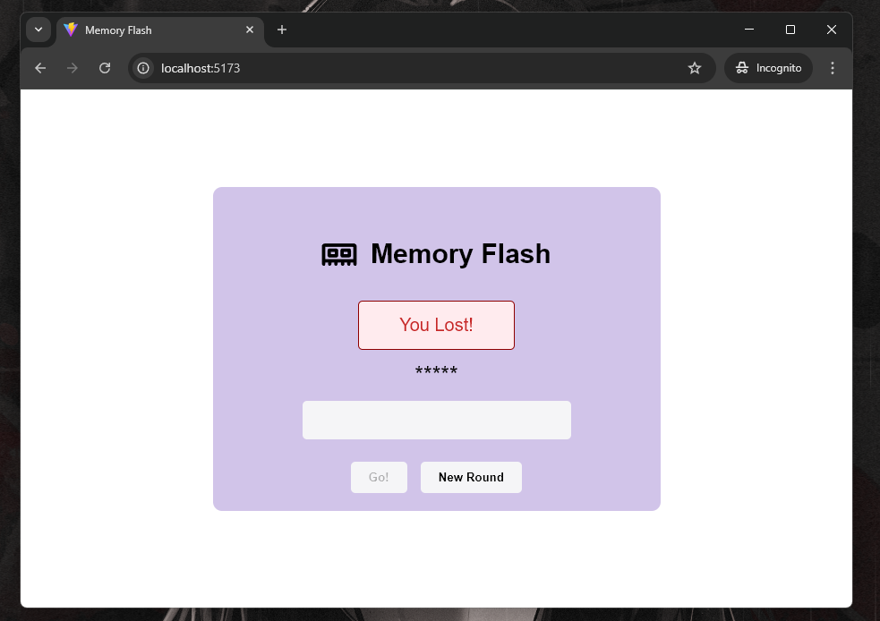

# Memory Flash

A fast-paced memory challenge game where 5 random letters or numbers flash briefly on the screen, and the player must recall and type them correctly.

# Screenshots

### Initial State

    

### Winning State

    

### Losing State

    

    

