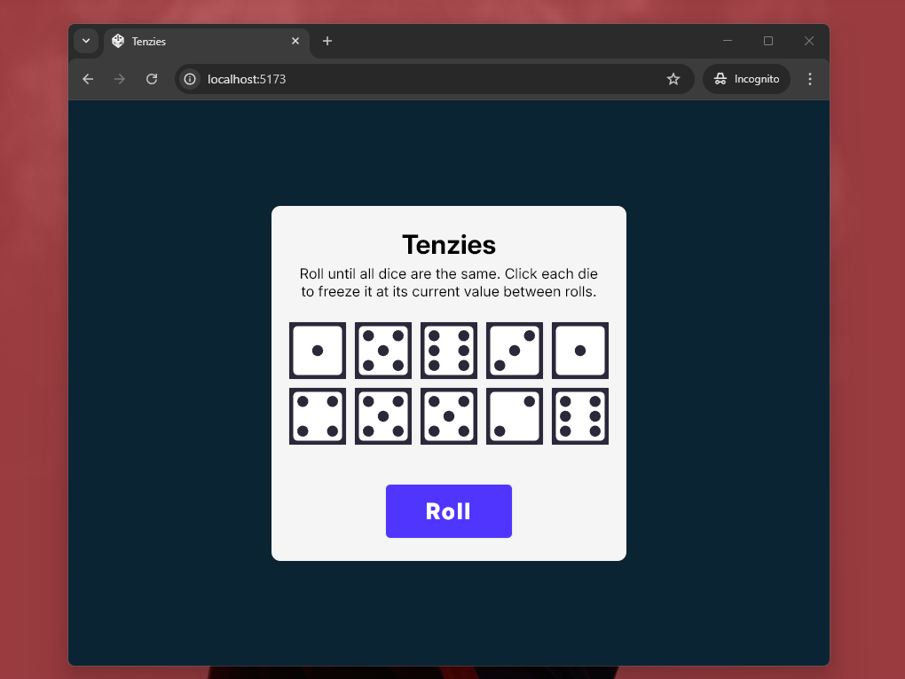
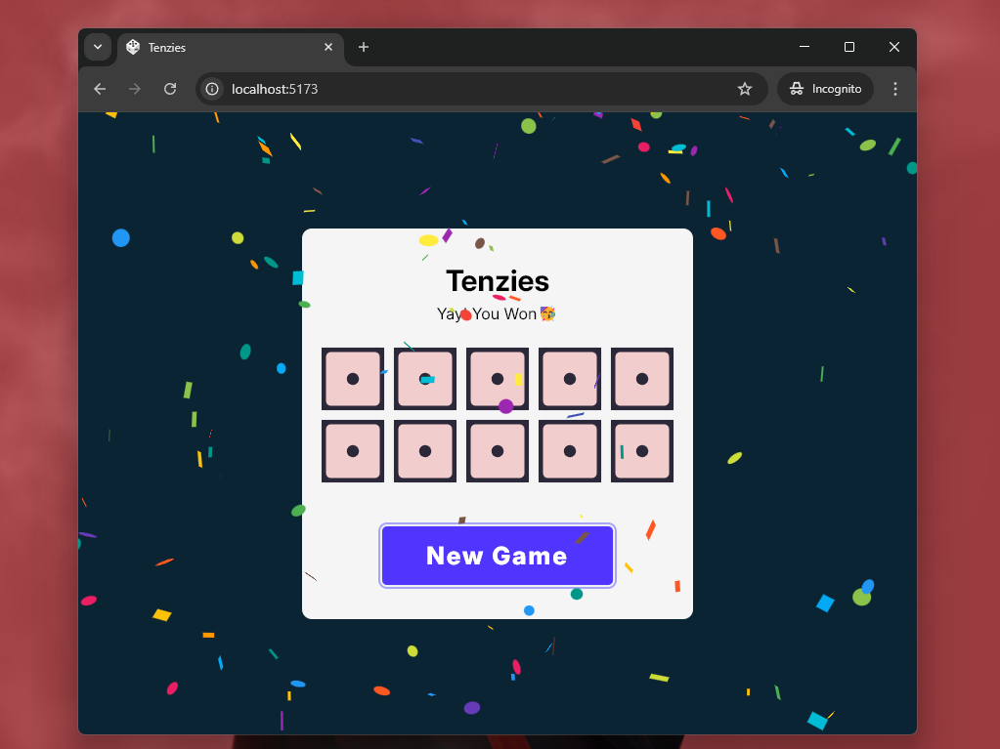

# Tenzies

Tenzies – A simple dice game built with React where players roll dice     until all show the same number, with the option to hold individual dice to lock their values.

# Screensots

### 1. Initial State

    

### 2. Winning State

    

