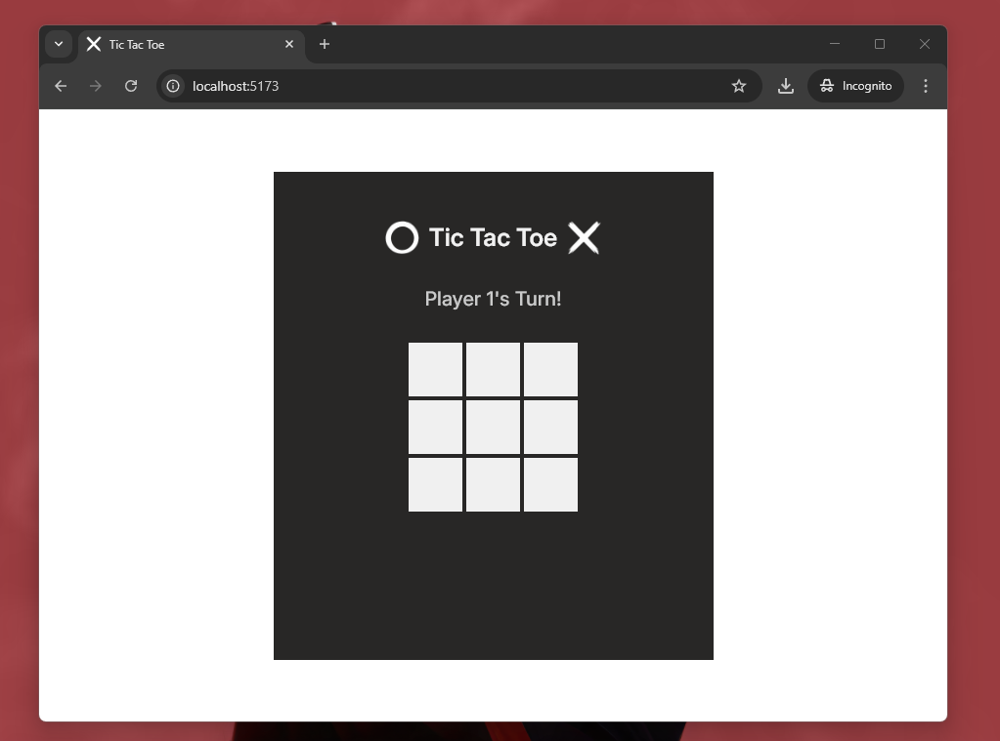

# Tenzies

A simple Tic-Tac-Toe game built with React, allowing two players to take turns marking X or O on a 3x3 grid. The game detects the winner or a draw and allows for a new game reset.

# Screensots

### 1. Initial State

    

### 2. Winning State

    
    

### 3. Draw/Tie State

    

